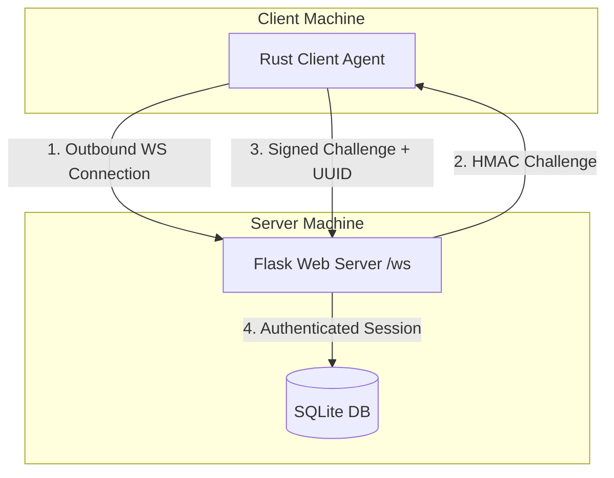

# TimeKpr WebUI

A modern, web-based interface for managing TimeKpr-nExT parental controls across multiple computers in your network.

This project uses a server-agent architecture: the Flask server hosts the Web UI and WebSocket hub, while each managed Linux machine runs a lightweight Rust agent (`timekpr-agent`) that connects outbound to the server. That removes the need for inbound management ports on client machines, but it still requires normal secret handling and transport security.


---

## Key Architectural Features

- **Outbound agent connections**: Client agents connect outbound to the server WebSocket endpoint (`/ws`), so managed devices do not need an inbound management daemon or open admin port.
- **Challenge-response device authentication**: Approved agents authenticate by signing a server challenge with HMAC-SHA256 using a per-device secret. The shared bootstrap token is not sent over the wire.
- **Persistent host identity**: Each client stores a generated UUID (`system_id`), so DHCP and other IP changes do not break mappings, while the UI prefers the current hostname for readability.
- **Pending-device approval flow**: New devices can remain in a pending state until an administrator approves them in the Web UI.
- **Offline-safe command queueing**: The server can queue changes for offline systems and apply them when the agent reconnects.
- **D-Bus-backed client control**: The agent maps a fixed set of TimeKpr-related actions onto the upstream TimeKpr D-Bus API instead of executing `timekpra` commands.

---

## Getting Started



### Prerequisites

- **Docker and Docker Compose** on the server machine, unless you are doing a manual server install
- **TimeKpr-nExT** installed on each client machine you want to manage, with its system D-Bus service available to privileged callers
- **Rust toolchain** only if you plan to build the agent from source instead of downloading a release

---

## 1. Server Deployment

1. **Clone the repository:**
   ```bash
   git clone https://github.com/adambie/timekpr-webui.git
   cd timekpr-webui
   ```

2. **Configure the environment:**
   Set a strong bootstrap token and timezone. You can also enable an optional registration firewall token to stop unknown clients from creating pending device records.
   ```yaml
   environment:
     - TZ=Europe/London
     - AGENT_TOKEN=replace-with-a-long-random-bootstrap-token
     # Optional: require new clients to know this extra pairing token
     # - REGISTRATION_TOKEN=replace-with-a-second-random-token
   ```

3. **Start the server stack:**
   ```bash
   docker-compose up -d --build
   ```
   The Compose file starts:
   - `web`: the Flask/Gunicorn UI on port `5000`
   - `tasks`: a dedicated background worker for sync, blocklist refreshes, and alert delivery

   Running background work in a separate process prevents large sync jobs from stalling or timing out the Gunicorn web worker.

4. **Expose the Web UI and WebSocket endpoint securely:**
   Prefer terminating TLS in a reverse proxy and pointing clients at `wss://YOUR_HOST/ws`.

   Use `ws://SERVER_IP:5000/ws` only on a trusted local network or for testing. Without TLS, the client does not authenticate the server, so an on-path attacker could spoof the server and send allowed commands to the agent.

5. **Initialize credentials:**
   Browse to the Web UI, sign in with the default admin account, and change it immediately:
   - **Username**: `admin`
   - **Password**: `admin`

---

## 2. Client Agent Deployment

Run the following on each client machine that already has TimeKpr-nExT installed.

### Option A: Install From the Latest GitHub Release

The repository includes `scripts/install-agent.sh`, which downloads the correct release asset for the machine architecture, installs the binary, writes a root-only config file, and installs a systemd service.

Download the script, review it, then run it:

```bash
curl -fsSLo /tmp/install-timekpr-agent.sh \
  https://raw.githubusercontent.com/pantherale0/timekpr-webui/master/scripts/install-agent.sh
chmod 0755 /tmp/install-timekpr-agent.sh
sudo /tmp/install-timekpr-agent.sh --server-url "wss://timekpr.example.com/ws"
```

The installer prompts for the bootstrap `AGENT_TOKEN` if it is not already present in `/etc/timekpr-agent/config.json`. You can also provide values non-interactively:

```bash
sudo /tmp/install-timekpr-agent.sh \
  --server-url "wss://timekpr.example.com/ws" \
  --agent-token-file /root/timekpr-bootstrap-token.txt \
  --registration-token-file /root/timekpr-registration-token.txt
```

Notes:

- The script preserves an existing `agent_token` by default so that upgrades do not overwrite the per-device secret stored after approval.
- Use `--replace-agent-token` only when you intentionally want to reconfigure the client token.
- The script downloads GitHub release assets over HTTPS. If you require stronger release provenance, publish signed checksums or build from source instead.
- If you are testing from a checkout before the first tagged release exists, use the manual build flow below.

### Option B: Build the Agent From Source

1. **Compile the agent:**
   ```bash
   cd agent
   cargo build --release
   ```

2. **Install the binary:**
   ```bash
   sudo install -d -m 0755 /usr/local/bin
   sudo install -m 0755 target/release/timekpr-agent /usr/local/bin/timekpr-agent
   ```

3. **Create the configuration directory with root-only access:**
   ```bash
   sudo install -d -m 0700 -o root -g root /etc/timekpr-agent
   ```

4. **Create `/etc/timekpr-agent/config.json`:**
   ```json
   {
     "server_url": "wss://YOUR_HOST/ws",
     "system_id": null,
     "registration_token": "optional-registration-firewall-token",
     "agent_token": "your-bootstrap-agent-token"
   }
   ```

5. **Lock down the config file permissions:**
   ```bash
   sudo chown root:root /etc/timekpr-agent/config.json
   sudo chmod 0600 /etc/timekpr-agent/config.json
   ```

6. **Start the agent once to generate a host UUID:**
   ```bash
   sudo /usr/local/bin/timekpr-agent
   ```

   On first launch, the agent generates and persists a unique `system_id`. It also reports the machine hostname to the server so the admin UI can show a readable device name:

   ```text
   ------------------------------------------------------------
   GENERATE NEW HOST UUID: 8f88c3a1-7ab3-4b68-b7eb-116b47cbf2fb
   PLEASE REGISTER THIS HOST UUID IN THE SERVER WEB UI PANEL!
   ------------------------------------------------------------
   ```

7. **Install the systemd service:**
   Create `/etc/systemd/system/timekpr-agent.service`:
   ```ini
   [Unit]
   Description=Timekpr WebSocket Client Agent
   After=network-online.target
   Wants=network-online.target

   [Service]
   Type=simple
   User=root
   Group=root
   UMask=0077
   ExecStart=/usr/local/bin/timekpr-agent
   Restart=always
   RestartSec=5

   [Install]
   WantedBy=multi-user.target
   ```

   Then enable and start it:

   ```bash
   sudo systemctl daemon-reload
   sudo systemctl enable timekpr-agent.service
   sudo systemctl start timekpr-agent.service
   ```

### Option C: Run the Python Debug Agent

If you want to debug server-side flows without a separate Linux client, TimeKpr D-Bus, or a second computer on the network, the repository includes a lightweight Python simulator at `server/debug_agent.py`.

It speaks the same WebSocket protocol as the Rust agent, persists its state in a JSON file, auto-creates users on first validation by default, and supports the server actions used for:

- user validation
- time-left adjustments
- weekly schedule sync
- allowed-hours sync
- domain-policy sync
- AppArmor policy sync

Run it from the repository checkout:

```bash
cd server
pip install -r requirements.txt
python debug_agent.py --server-url "ws://127.0.0.1:5000/ws" --agent-version "v0.10"
```

Notes:

- The script creates `server/debug-agent.json` automatically and stores the generated `system_id`, paired `agent_token`, fake user state, and synced policy state there.
- A fresh config starts with three fake users (`alice`, `bob`, and `charlie`) so validation, schedule sync, and time adjustments have something to operate on immediately.
- On first start, the server will usually register it as a pending device. Approve it in the admin UI once, and the script will store the issued device token and reconnect automatically.
- After the first successful authentication, it also sends a small one-shot set of synthetic alerts so the device and alert views have sample activity to inspect.
- Once authenticated, the connection now stays open and the agent emits a random synthetic alert or policy-sync check on a timer. Use `--activity-interval 5` to make it chattier during debugging, or `--activity-interval 0` to disable that background traffic.
- The `agent_version` must match the server version reported by the running server, just like the Rust agent.
- Add `--strict-users` if you want validation to fail for usernames that are not already present in the JSON state file.
- Add `--emit-startup-alert` if you also want to exercise the alert-ingest path on each successful authentication.

### Important Token Lifecycle Notes

- `AGENT_TOKEN` on the server is a **bootstrap token** used to enroll or recover clients before approval.
- After a device is approved, the server generates a **device-specific secret** and sends it to that agent. The agent stores that new secret back into `/etc/timekpr-agent/config.json`.
- After approval, the client `agent_token` will usually **no longer match** the server-wide `AGENT_TOKEN`. That is expected.
- If a client's config file is exposed, treat the stored `agent_token` as compromised. Reject and re-approve the device to mint a new per-device secret.

---

## 3. Approve Devices and Map Users

1. Start the agent and open the Web UI.
2. In the admin panel, approve the pending device. The UI shows the hostname when available, and appends the final two UUID characters if multiple devices share the same hostname.
3. Add or map users to the approved device entry. Internally, mappings still use the stable `system_id`.
4. Once the device is approved, the next successful challenge-response handshake marks it online and ready for remote actions.

---

## 4. Manual Server Setup (Without Docker)

1. **Install Python dependencies:**
   ```bash
   cd server
   pip install -r requirements.txt
   ```

2. **Set environment variables:**
   ```bash
   export AGENT_TOKEN="replace-with-a-long-random-bootstrap-token"
   export TZ="Europe/London"
   # Optional:
   # export REGISTRATION_TOKEN="replace-with-a-second-random-token"
   ```

3. **Start the Flask web application:**
   ```bash
   python app.py
   ```

4. **Start the background task worker in a separate process:**
   ```bash
   python task_worker.py
   ```

   Do not run the background task manager inside a Gunicorn worker process. Keeping it separate prevents long-running blocklist refreshes and other sync work from taking down the web worker.

5. **Still place it behind TLS if clients connect across anything other than a trusted local network.**

---

## Security Configuration

- **Use `wss://` whenever possible**: The HMAC handshake prevents simple replay and keeps the token out of the handshake itself, but it does not replace TLS. Without TLS, the client cannot authenticate the server.
- **Protect `/etc/timekpr-agent/config.json`**: Keep it owned by `root:root` with mode `0600`. That file contains either the bootstrap token or, after approval, the per-device secret used for authentication.
- **Consider enabling `REGISTRATION_TOKEN`**: This optional second secret blocks unauthorized clients from creating new pending device entries.
- **Do not expose port `5000` directly to the internet without a reverse proxy**: Restrict access to trusted clients or terminate HTTPS/WSS in front of the app.
- **Change the default admin password immediately**: The default `admin` / `admin` credentials are only for first boot.
- **Understand the command model**: The agent only handles a fixed allow-list of TimeKpr-related commands, but those commands are privileged and the service normally runs as `root`.
- **Treat release downloads as transport-authenticated, not content-signed**: The install script uses GitHub Releases over HTTPS. If you need cryptographic artifact verification, publish checksums/signatures or build locally.

---

## Troubleshooting

- **Agent remains offline in the dashboard**:
  - Verify that `server_url` points to the correct server and path, preferably `wss://YOUR_HOST/ws`.
  - For a new or re-paired client, verify that `agent_token` matches the server `AGENT_TOKEN`.
  - If `REGISTRATION_TOKEN` is enabled on the server, make sure the client config includes the matching `registration_token`.
  - If the device was already approved, do not replace the config token with the bootstrap token unless you are intentionally re-pairing it.
  - Check the service logs: `journalctl -u timekpr-agent.service -n 50 --no-pager`

- **Commands are not applied**:
  - Ensure the agent service is running as `root`, because TimeKpr administrative changes require elevated privileges.
  - Confirm that TimeKpr-nExT is installed and the `com.timekpr.server` system-bus service is reachable on the client.
  - Review recent agent logs for D-Bus or permission errors.

---

## License

MIT License. See `LICENSE` for details.

## Acknowledgements

- Works in tandem with [Timekpr-nExT](https://mjasnik.gitlab.io/timekpr-next/), a parental control tool for Linux.
- Built with Flask, Flask-Sock, gevent, and Rust.
