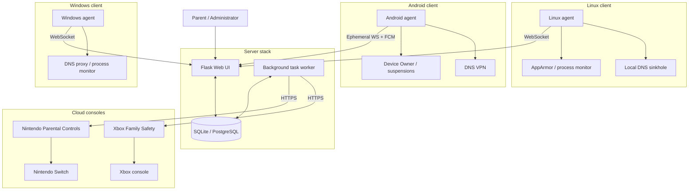

# Guardian documentation

Guardian is a cross-platform parental control system with a **server–agent architecture**. The Flask server hosts the Web UI, REST APIs, and WebSocket hub. Managed devices run client agents (Rust on Linux and Windows, Kotlin on Android) that connect **outbound** to the server. Nintendo Switch and Xbox consoles are managed through cloud APIs—no on-console agent required.

## Key features

- **Outbound-only connections** — agents dial the server; no inbound ports on child devices.
- **HMAC challenge–response auth** — per-device secrets after admin approval; bootstrap token never sent post-pairing.
- **Pending-device approval** — new agents wait in **Admin → Devices** until approved.
- **Offline-safe queuing** — policy changes apply on the next agent sync.
- **App discovery** — agents report installed apps and icons for policy configuration.
- **Cloud console sync** — Nintendo and Xbox playtime and schedules via background worker.

## Quick links

| I want to… | Start here |
|------------|------------|
| Deploy the server | [Server deployment](getting-started/server-deployment.md) |
| Pair a Linux PC | [Linux agent](platforms/linux-agent.md) · [Pairing workflow](workflows/pairing-and-approval.md) |
| Pair an Android device | [Android agent](platforms/android-agent.md) |
| Pair a Windows PC | [Windows agent](platforms/windows-agent.md) |
| Add a Switch or Xbox | [Cloud console setup](workflows/cloud-console-setup.md) |
| Configure schedules & filters | [Schedules & limits](web-ui/schedules-and-limits.md) · [Web filters](web-ui/web-filters.md) |
| Troubleshoot Android multi-user | [Troubleshooting](troubleshooting/index.md) |

## Platform comparison

See the full [policy matrix](reference/policy-matrix.md) for how each restriction maps to Linux, Android, Windows, Nintendo, and Xbox.

## Default credentials

After a fresh install, sign in with **admin** / **admin** and change the password immediately under **Settings**.
