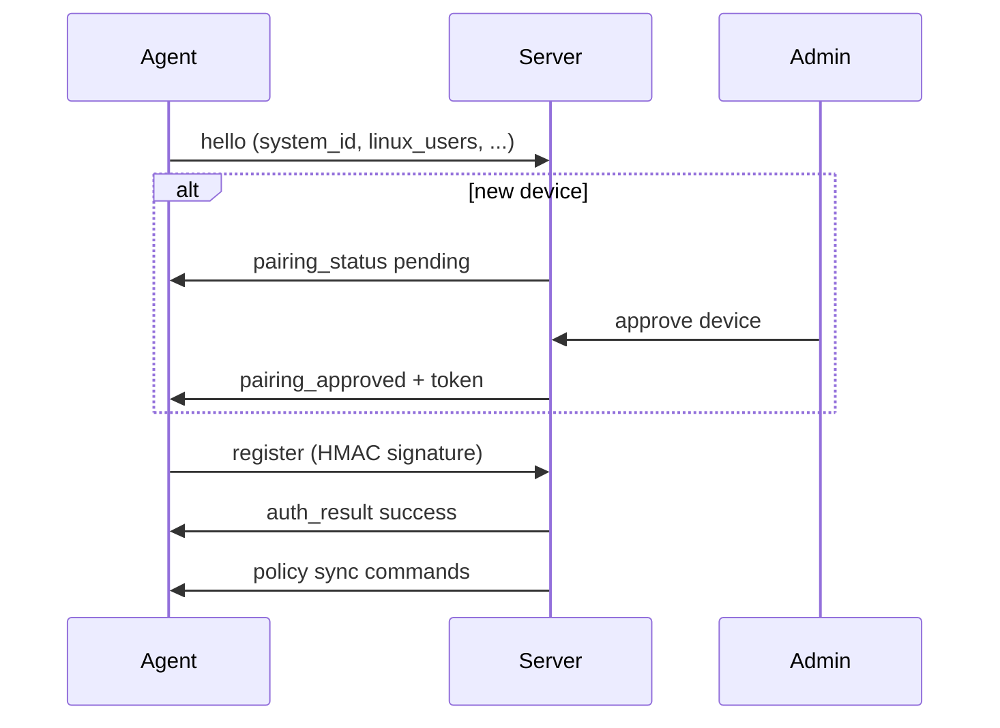

# Pairing and approval

All hardware agents follow the same high-level enrollment flow. Cloud consoles (Nintendo/Xbox) skip pending approval.

## Linux

1. Run [install script](https://github.com/pantherale0/timekpr-webui/blob/master/scripts/install-agent.sh) or install binary manually with `server_url` and bootstrap token.
2. Approve in **Admin → Devices**.
3. Map `/etc/passwd` username to child account.

Or scan **Settings → Agent pairing** QR from a configured agent.

## Android

Two paths:

- **In-app QR** — APK installed; scan server QR; approve device
- **MDM QR** — factory-reset 6-tap; Device Owner + auto-config (recommended for parental control)

See [Android agent](../platforms/android-agent.md).

## Windows

**Add Device → Windows PC** — run PowerShell/MSI installer as Administrator; approve pending device.

See [Windows agent](../platforms/windows-agent.md).

## Registration token

If `REGISTRATION_TOKEN` is set on the server, agents must include it in `hello` or pairing is refused.

## After approval

1. Create or select child account
2. Add device mapping with correct username/UID
3. Click **Verify** on mapping
4. Configure schedules and policies

## Related

- [WebSocket protocol](../reference/websocket-protocol.md)
- [Child accounts & mappings](../web-ui/child-accounts-and-mappings.md)
